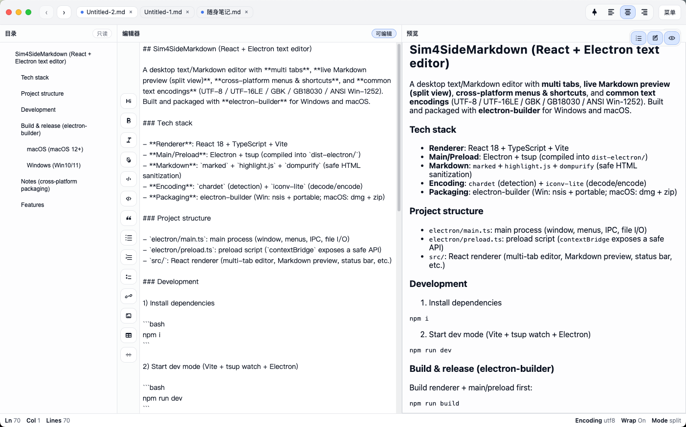
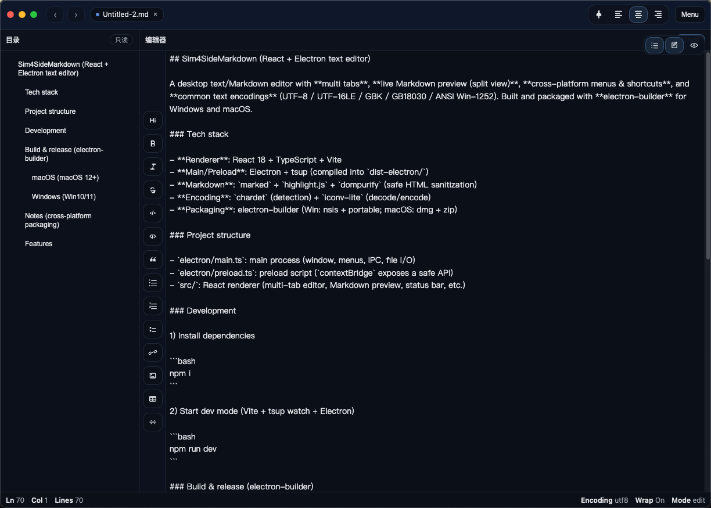
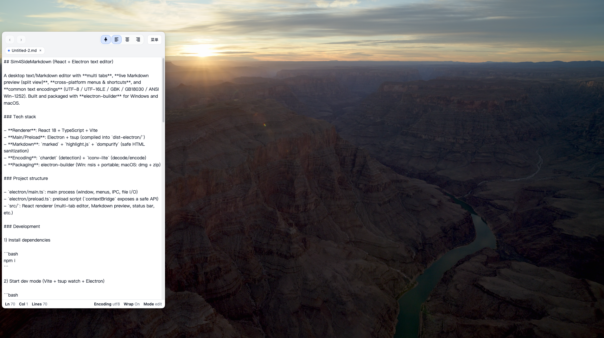

## SIde Markdown

A desktop text/Markdown editor with **multi tabs**, **live Markdown preview (split view)**, **cross-platform menus & shortcuts**, and **common text encodings** (UTF-8 / UTF-16LE / GBK / GB18030 / ANSI Win-1252). Built and packaged with **electron-builder** for Windows and macOS.

### Release notes (v1.1.0)

- Added automatic in-app updates via GitHub Releases (electron-updater).
- Fixed preview scroll not following editor scroll.

### Tech stack

- **Renderer**: React 18 + TypeScript + Vite
- **Main/Preload**: Electron + tsup (compiled into `dist-electron/`)
- **Markdown**: `marked` + `highlight.js` + `dompurify` (safe HTML sanitization)
- **Encoding**: `chardet` (detection) + `iconv-lite` (decode/encode)
- **Packaging**: electron-builder (Win: nsis + portable; macOS: dmg + zip)

### Project structure

- `electron/main.ts`: main process (window, menus, IPC, file I/O)
- `electron/preload.ts`: preload script (`contextBridge` exposes a safe API)
- `src/`: React renderer (multi-tab editor, Markdown preview, status bar, etc.)

### Development

1) Install dependencies

```bash
npm i
```

2) Start dev mode (Vite + tsup watch + Electron)

```bash
npm run dev
```

### Analytics (build-time env)

Analytics is configured via **Vite build-time env** (renderer). Create `.env.local` and restart dev server / rebuild.
You can start from `env.sample` (copy to `.env.local`).

- **VITE_ANALYTICS_ENABLED**: `true` / `false` (default: `true`)
- **VITE_ANALYTICS_REGION**: `auto` / `cn` / `non-cn` (default: `auto`)
  - `auto`: determine CN/non-CN **by OS timezone only** (e.g. `Asia/Shanghai` => CN)
- **VITE_ANALYTICS_PROVIDER**: `auto` / `baidu` / `ga` / `both` (default: `auto`)
- **VITE_ANALYTICS_DEBUG**: `true` / `false` (default: `false`)
- **VITE_BAIDU_SITE_ID**: Baidu Tongji site id (optional)
- **VITE_GA_MEASUREMENT_ID**: GA measurement id like `G-XXXXXXX` (optional)

Notes:
- When region is inferred as **CN**, the app will pick **Baidu first** (if `VITE_BAIDU_SITE_ID` is set). Google is only used when region is **non-CN**, or when Baidu id is empty.
- To force Google analytics, set **`VITE_ANALYTICS_REGION=non-cn`** and provide a valid **`VITE_GA_MEASUREMENT_ID`**.
- In some networks (e.g. mainland China), `googletagmanager.com` may be blocked, causing GA script injection to fail.

### Build & release

Build renderer + main/preload first:

```bash
npm run build
```

#### macOS (macOS 12+)

```bash
npm run dist:mac
```

Artifacts will be in `release/` (`dmg` + `zip`).

#### Windows (Win10/11)

```bash
npm run dist:win
```

Artifacts will be in `release/` (NSIS installer + portable exe).

### Auto update

- The app checks GitHub Releases in the background on startup, shows a **red dot** in the in-app menu when a new version is available, and installs the update after you click it.
- **Windows**: auto update works with the **NSIS installer** build (portable exe does **not** support auto update).
- **macOS**: auto update uses the `zip` artifact generated by electron-builder.
- Required release assets:
  - **macOS**: `latest-mac.yml` + `*.zip` (+ `*.blockmap`)
  - **Windows**: `latest.yml` + `*.exe` (+ `*.blockmap`)

#### Publishing to GitHub

Use `electron-builder --publish` so the required `latest-*.yml` files are uploaded automatically.

You must provide a GitHub token:

```bash
export GH_TOKEN="YOUR_GITHUB_PAT"
```

Recommended scripts (publish per-arch):

```bash
# macOS (Apple Silicon)
npm run dist:mac:apple:publish

# macOS (Intel)
npm run dist:mac:intel:publish

# Windows (run on Windows)
npm run dist:win:publish
```

### Notes

- **Build on the target OS**: build macOS apps on macOS, Windows apps on Windows (toolchains/signing/system components differ).
- This project ships **without code signing** by default (`dmg.sign=false`). For production releases, add certificates and signing.

### Screenshots

**Preview**



**Dark mode**



**Docked mode**



### Features

- **File**: New / Open (multi-select) / Save / Save As / Close Tab / Quit
- **Edit**: Undo/Redo, Cut/Copy/Paste, Select All, Find/Replace, Go to Line, Insert Date/Time
- **Format/View**: Word wrap, Font settings, Status bar toggle, Markdown edit/preview/split toggle
- **Encoding**: UTF-8 / UTF-16LE / GBK / GB18030 / ANSI (Win-1252)


